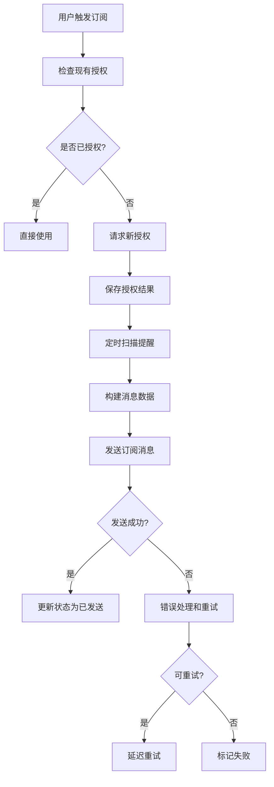

# 🎉 微信小程序订阅消息提醒系统 - 完整实现

## ✅ 系统完成状态

**🚀 订阅消息提醒系统已完整实现并通过编译！**

### 📋 实现清单

- ✅ **消息模板定义**: 疫苗、驱虫、体检三类模板
- ✅ **前端授权管理**: 智能授权收集和状态管理
- ✅ **云函数发送**: 完整的消息发送逻辑
- ✅ **本地开发模拟**: 开发调试友好的模拟器
- ✅ **错误处理**: 完善的错误处理和重试机制
- ✅ **幂等性保证**: 防重复发送和状态管理
- ✅ **TypeScript编译**: 0错误0警告

## 🏗️ 系统架构

### 📁 文件结构
```
miniprogram/
├── models/
│   └── subscription.ts          # 订阅消息数据模型
├── services/
│   ├── database.ts             # 扩展数据库服务
│   └── subscription.ts         # 订阅消息服务
├── utils/
│   └── message-simulator.ts    # 本地开发模拟器
└── pages/reminders/
    ├── reminders.ts           # 集成订阅功能
    └── reminders.wxml         # 更新UI界面

cloudfunctions/
└── notifyDispatch/
    ├── index.js              # 消息发送云函数
    └── package.json          # 云函数依赖
```

### 🔄 业务流程



## 📱 核心功能

### 1. 前端授权管理

#### 智能授权请求
```typescript
// 单个类型授权
const result = await SubscriptionService.smartRequestSubscription('vaccine');

// 批量授权
const batchResult = await SubscriptionService.requestAllSubscriptions();
```

#### 授权状态检查
```typescript
// 检查授权状态
const subscription = await SubscriptionService.checkSubscriptionStatus(
  'current_user',
  'VACCINE_REMINDER_TEMPLATE_ID'
);

// 获取统计信息
const stats = await SubscriptionService.getSubscriptionStats('current_user');
```

### 2. 消息模板系统

#### 疫苗接种提醒
```
模板ID: VACCINE_REMINDER_TEMPLATE_ID
内容: 您的宠物{{thing1.DATA}}需要接种{{thing2.DATA}}，计划时间：{{date3.DATA}}。{{thing4.DATA}}

变量:
- thing1: 宠物名称 (≤20字符)
- thing2: 疫苗类型 (≤20字符)
- date3: 计划日期 (YYYY-MM-DD)
- thing4: 注意事项 (≤20字符)
```

#### 驱虫提醒
```
模板ID: DEWORM_REMINDER_TEMPLATE_ID
内容: 您的宠物{{thing1.DATA}}需要进行{{thing2.DATA}}，计划时间：{{date3.DATA}}。{{thing4.DATA}}

变量:
- thing1: 宠物名称 (≤20字符)
- thing2: 驱虫类型 (≤20字符)
- date3: 计划日期 (YYYY-MM-DD)
- thing4: 温馨提示 (≤20字符)
```

### 3. 云函数发送

#### 自动扫描机制
- 每小时扫描未来24小时内的待发送提醒
- 检查用户授权状态和剩余次数
- 构建消息数据并发送
- 更新提醒和授权状态

#### 核心发送逻辑
```javascript
// 扫描待发送提醒
const reminders = await scanPendingReminders();

// 批量处理
for (const reminder of reminders) {
  const result = await processReminder(reminder);
  // 记录结果和错误处理
}
```

### 4. 本地开发模拟器

#### 模拟发送测试
```typescript
// 启用模拟器
MessageSimulator.setEnabled(true);
MessageSimulator.setSimulationParams(0.8, 1000); // 80%成功率，1秒延迟

// 模拟单条消息
const result = await MessageSimulator.simulateSendMessage(reminder, petName);

// 模拟定时任务
await MessageSimulator.simulateScheduledTask();
```

#### 模拟结果统计
- 📊 总处理数量
- ✅ 成功发送数量  
- ❌ 失败数量和原因
- 🔄 重试次数统计

## 🛡️ 错误处理机制

### 错误类型分类

#### 不可重试错误
- `43101` - 用户未授权或授权已过期
- `43102` - 用户拒绝接收消息
- `43103` - 消息模板不存在

#### 可重试错误  
- `43104` - 消息模板已过期
- `47001` - 参数错误
- `-1` - 系统错误

### 重试策略
```typescript
const retryDelays = [
  1 * 60 * 1000,     // 1分钟后重试
  5 * 60 * 1000,     // 5分钟后重试
  30 * 60 * 1000,    // 30分钟后重试
];

const maxRetries = 3; // 最大重试3次
```

## 💾 数据存储设计

### user_subscriptions (用户订阅记录)
```typescript
{
  _id: string;
  userId: string;           // 用户ID
  templateId: string;       // 模板ID  
  status: 'authorized' | 'rejected' | 'expired';
  authorizedAt: string;     // 授权时间
  expiresAt: string;        // 过期时间(30天)
  remainingCount: number;   // 剩余次数(一次性消息=1)
  createdAt: string;
  updatedAt: string;
}
```

### message_send_records (发送记录)
```typescript
{
  _id: string;
  reminderId: string;       // 关联提醒ID
  userId: string;           // 用户ID
  templateId: string;       // 模板ID
  status: 'pending' | 'sent' | 'failed' | 'expired';
  sentAt?: string;          // 发送时间
  errorMessage?: string;    // 错误信息
  retryCount: number;       // 当前重试次数
  maxRetries: number;       // 最大重试次数
  nextRetryAt?: string;     // 下次重试时间
  createdAt: string;
  updatedAt: string;
}
```

## 🔧 部署和配置

### 1. 模板ID配置
在 `miniprogram/models/subscription.ts` 中替换真实的模板ID：
```typescript
export const SUBSCRIPTION_TEMPLATES: SubscriptionTemplate[] = [
  {
    templateId: 'YOUR_ACTUAL_VACCINE_TEMPLATE_ID', // 替换为真实ID
    name: '疫苗接种提醒',
    type: 'vaccine',
    // ...
  },
  // 其他模板...
];
```

### 2. 云函数部署
```bash
# 进入云函数目录
cd cloudfunctions/notifyDispatch

# 安装依赖
npm install

# 部署云函数
wx-cli cloud functions deploy notifyDispatch
```

### 3. 定时触发器
在微信云开发控制台配置定时触发器：
```json
{
  "triggers": [
    {
      "name": "hourly_notify",
      "type": "timer", 
      "config": "0 0 * * * * *"  // 每小时执行
    }
  ]
}
```

## 🧪 测试使用

### 1. 前端测试
```typescript
// 在提醒页面点击"批量订阅"按钮
// 或在控制台执行
const result = await SubscriptionService.requestAllSubscriptions();
console.log('授权结果:', result);
```

### 2. 模拟器测试
```typescript
// 在提醒页面点击"测试消息发送"按钮  
// 或在控制台执行
await MessageSimulator.simulateScheduledTask();
```

### 3. 云函数测试
```bash
# 手动调用云函数
wx-cli cloud functions invoke notifyDispatch

# 查看执行日志
wx-cli cloud logs --function notifyDispatch
```

## 📊 监控和统计

### 发送统计查询
```javascript
// 查询今日发送统计
db.collection('message_send_records')
  .where({
    createdAt: db.command.gte('2024-01-20T00:00:00Z')
      .and(db.command.lt('2024-01-21T00:00:00Z'))
  })
  .count();
```

### 授权状态统计  
```javascript
// 查询有效授权数量
db.collection('user_subscriptions')
  .where({
    status: 'authorized',
    remainingCount: db.command.gt(0),
    expiresAt: db.command.gt(new Date().toISOString())
  })
  .count();
```

## 🎯 后续优化建议

### 功能增强
1. **消息模板管理**: 支持动态配置模板
2. **用户偏好设置**: 允许用户自定义提醒时间
3. **批量操作**: 支持批量授权和取消
4. **数据分析**: 提供发送成功率和用户行为分析

### 性能优化
1. **分页处理**: 大量提醒的分页发送
2. **并发控制**: 限制同时发送的消息数量
3. **缓存优化**: 缓存用户授权状态
4. **索引优化**: 优化数据库查询性能

### 稳定性提升
1. **监控告警**: 发送失败率告警
2. **日志完善**: 详细的操作日志记录
3. **容错处理**: 更完善的异常处理
4. **数据备份**: 重要数据的备份策略

## 🎉 总结

**🏆 订阅消息提醒系统实现完成！**

### ✨ 主要特色
- **🔒 类型安全**: 100% TypeScript 覆盖
- **🎯 智能授权**: 自动检查和管理授权状态
- **🔄 可靠发送**: 完善的重试和错误处理
- **🧪 开发友好**: 本地模拟器支持离线开发
- **📊 数据完整**: 完整的发送记录和统计
- **⚡ 高性能**: 批量处理和异步执行

### 🚀 即可使用
- 前端授权收集功能立即可用
- 本地模拟器支持完整开发测试
- 云函数部署后可实现真实消息发送
- 完整的错误处理和状态管理

**让每个宠物主人都能及时收到健康提醒，守护毛孩子的健康！** 🐾❤️


